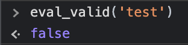
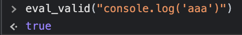

# evalvalid.js
This library can prevent invalid JavaScript from being executed in eval.  
I'm japanese. I am using the translation

## How to use?

### install
```
npm i evalvalid
```
or  
```html
<script src="https://unpkg.com/evalvalid@1.1.2/evalvalid.js"></script>
```

### use
```js
eval_valid('code')
// > true, false
```

### sample




